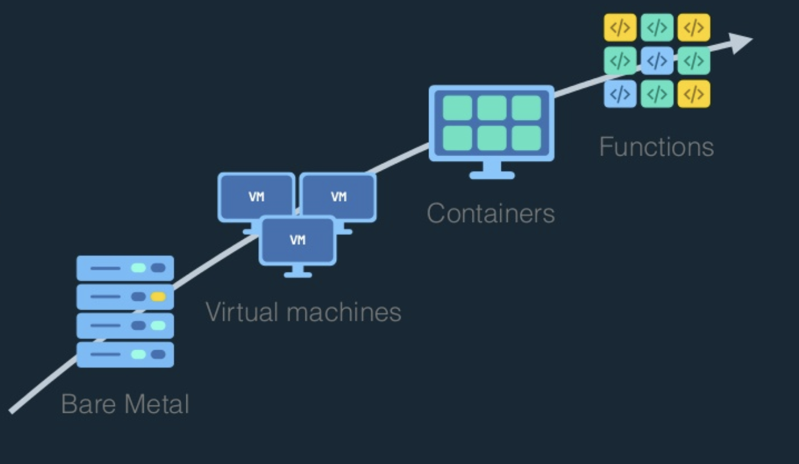

# docker

## timeline
 


## why

| VM | Container |
|--------|--------|
|    | |

## basic commands
- docker --version

- docker ps  - List containers
- docker build - Build an image from a Dockerfile
- docker run - creates and starts a container in one operation.
- docker rm - deletes a container.
- docker update - updates a container's resource limits.
- docker pull - Pull an image or a repository from a registry

## docker hub

https://hub.docker.com/explore/


- mysql
- redis
- ubuntu
- python
- https://hub.docker.com/_/nextcloud/

## Dockerfile

    docker build . -t git

```bash
FROM ubuntu
RUN apt-get update
RUN apt-get install git -y
CMD git --version
```
### output
```bash
Sending build context to Docker daemon  2.048kB
Step 1/4 : FROM ubuntu
 ---> 452a96d81c30
Step 2/4 : RUN apt-get update
 ---> Using cache
 ---> c8f06cdaad67
Step 3/4 : RUN apt-get install git -y
 ---> Using cache
 ---> d8148e3d24e0
Step 4/4 : CMD git --version
 ---> Using cache
 ---> 57aeb87a6282
Successfully built 57aeb87a6282
Successfully tagged git:latest
```

    docker run git

    git version 2.17.0

## fromgit (new command) 

### CMD 

https://docs.docker.com/engine/reference/builder/#cmd

### DockerLayers

https://docs.docker.com/storage/storagedriver/#images-and-layers
https://imagelayers.io/?images=redis:3.0.6


A Docker image is built up from a series of layers. Each layer represents an instruction in the image’s Dockerfile. Each layer except the very last one is read-only.

Each layer is only a set of differences from the layer before it. The layers are stacked on top of each other. When you create a new container, you add a new writable layer on top of the underlying layers. 

docker inspect hash
```
"RootFS": {
            "Type": "layers",
            "Layers": [
                "sha256:8fad67424c4e7098f255513e160caa00852bcff347bc9f920a82ddf3f60229de",
                "sha256:86985c679800f423275a0ea3ad540e9b7f522dcdcd65ec2b20f407996162f2e0",
                "sha256:6e5e20cbf4a7246b94f7acf2a2ceb2c521e95daca334dd1e8ba388fa73443dfe",
                "sha256:ff57bdb79ac820da132ad1fdc1e2d250de5985b264dbdf60aa4ce83a05c4da75",
                "sha256:6e1b48dc2cccd7c0faf316e5975f1a02f5897723d7fa3b0367b28a20173931d6",
                "sha256:cdcaace38a5493ed234ba1621d1f83080fe270bf6337d23718a58e8bfa37aa19",
                "sha256:9e17bfee4bf67067c2d54f652d6f7fae83a3ca29240afd0f23f0f0c72f63e02a",
                "sha256:3523755f4e34c5d41a0d0ffaeb01521fe63690b44213e663f29743a4759d7723",
                "sha256:3bb9ed4f086411d43ddbfb75066a47f50c1d1eccb27850f160dc4fd3aa2f54a8"
            ]
        },

```

## resources

https://docs.docker.com/get-started/#docker-concepts

https://github.com/wsargent/docker-cheat-sheet

https://www.slideshare.net/DanielKrook/containers-vs-serverless-navigating-application-deployment-options
