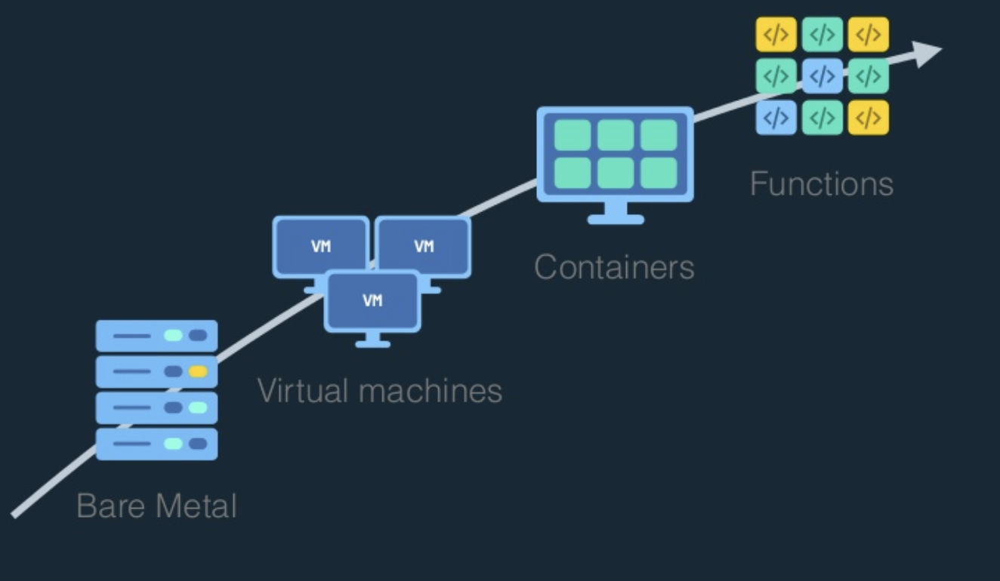
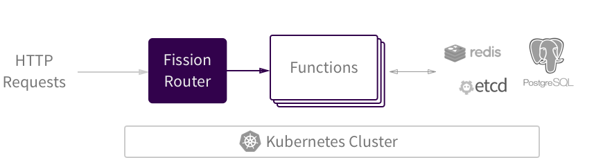

## CronJob

* Docker Container per restart policy als Job verwenden 

File: [Dockerfile](../04_ausblick/Dockerfile)


## Container Orchestration

### Kubernetes (K8s)

 


#### [Cloud Native Computing Foundationcd (CNCF)](https://www.cncf.io/)

https://www.cncf.io/projects/

https://landscape.cncf.io/

#### [minikube](https://github.com/kubernetes/minikube)

https://de.wikipedia.org/wiki/Kubernetes#/media/File:Kubernetes.png

Minikube is a tool that makes it easy to run Kubernetes locally. Minikube runs a single-node Kubernetes cluster inside a VM on your laptop for users looking to try out Kubernetes or develop with it day-to-day.

#### cronjobs

https://kubernetes.io/docs/concepts/workloads/controllers/cron-jobs/

File: [cronjob.yml](../04_perspective/cronjob.yml)

#### Fission: Serverless Functions for Kubernetes

 

 

##### Python - Hello World as a function
```python
def main():
    return "Hello, world!\n"
```

##### Node - Hello World as a function
```javascript
module.exports = async function(context) {
    return {
        status: 200,
        body: "Hello, world!\n"
    };
}
```

##### Cloud: 

* https://aws.amazon.com/de/lambda/
* https://cloud.google.com/functions/
* https://azure.microsoft.com/en-us/services/functions/

### Docker Swarm

 

    use a cluster like your local docker deamon

#### commands 

* swarm init
* swarm join
* service create
* service inspect
* service ls
* service rm
* service scale
* service ps
* service update
